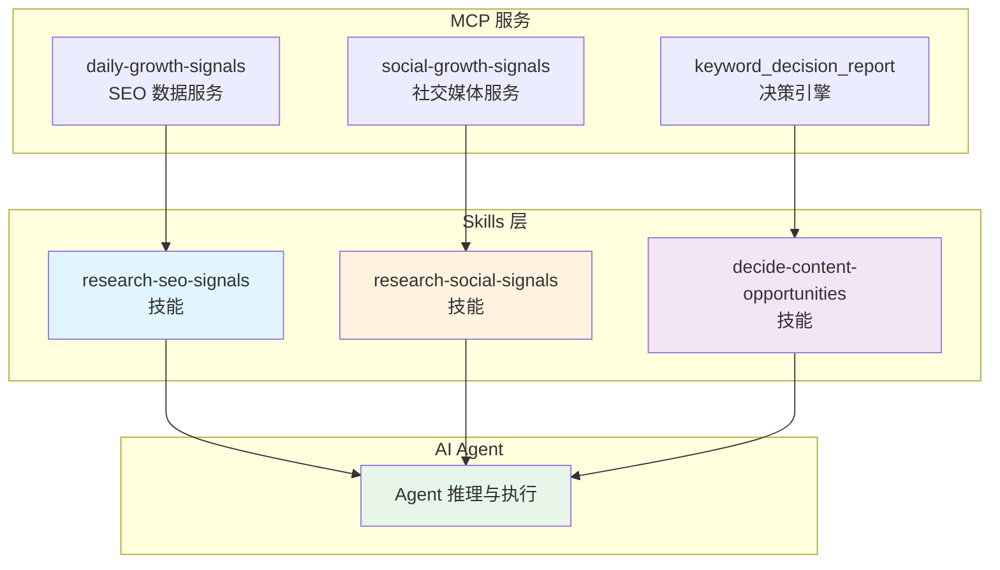

# SEO Signal Skills 说明文档

[English](README.md)

### 概述

SEO Signal Skills 是一套结构化的技能集，旨在通过 MCP（模型上下文协议）增强 AI Agent 与 SEO 及社交媒体数据服务交互时的精确性。这些技能提供标准化工作流程、清晰的使用指南以及预处理的数据解读，确保决策的准确性、高效性和证据支撑性。

### 技能集概述

SignalDig Skills 是一套基于 MCP 的 SEO 与内容增长技能集，覆盖从信号采集到决策的完整证据链：

- **研究 SEO 信号**（`research-seo-signals`）：检索有据可依的 SEO 需求信号——关键词概览与搜索意图、相关关键词、SERP 观察、Google Trends 趋势，支持多市场多语言，以最小必要范围提交、幂等复用请求。
- **检索社交信号**（`research-social-signals`）：从 X、Reddit、小红书、知乎、LinkedIn、微信公众号检索公开、可追溯、平台原生的社交数据，保留原始字段、时间戳与原生指标，只做检索不做决策。
- **决策内容机会**（`decide-content-opportunities`）：基于上述证据生成条件化的关键词与内容机会决策——明确立场、定性置信度、反证、条件、风险与下一步验证测试。

三个技能共享同一套原则：**一切结论必须有可追溯的证据 ID，绝不臆造指标，绝不把数据当决策，绝不越界替用户做最终判断**。适合搭建"证据驱动的增长工作流"，让 AI Agent 从"猜测型执行"升级为"证据约束型执行"。

### 为什么使用 Skills？

虽然 AI Agent 可以直接调用 MCP 工具，但使用结构化技能具有显著优势：

| 维度 | 不使用 Skills | 使用 Skills |
|------|--------------|-------------|
| **精确性** | Agent 可能调用错误的工具 | 保证选择正确的工具 |
| **效率** | Agent 随机探索工具组合 | 优化工作流程，最小化调用次数 |
| **数据理解** | 原始数据缺乏上下文 | 增强数据附带字段语义和详细解释 |
| **决策质量** | Agent 推理可能发散 | 聚焦分析，提供可操作建议 |

**核心优势**：

1. **精准执行**：每个技能对应特定场景，消除工具选择的盲目性
2. **增强数据理解**：预处理的信号已过滤过时数据，并标注字段含义
3. **前置推理机制**：在 Agent 处理前提取核心洞察和建议，防止推理发散
4. **内置操作手册**：作为 AI Agent 的使用指南，提升工具调用的自信心

---

### 技能分类

#### 1. 研究 SEO 信号 (`research-seo-signals`)

**MCP 服务**：`daily-growth-signals`

**用途**：从多个权威来源收集有据可依的 SEO 需求信号。

**数据来源**：
- Google Trends（搜索趋势随时间变化、地理分布、相关查询）
- 关键词概览与意图分析（搜索量、CPC、竞争指标）
- 相关关键词发现（语义扩展、长尾机会）
- Google/Bing SERP 数据（自然排名、SERP 特征、竞争格局）
- GEO 可见性、竞品上下文、网站外链与引用域名

**价值主张**：
与仅返回数字而无上下文的原始数据提供商不同，本服务：
- **过滤陈旧数据**：移除不再反映当前市场状况的过时信号
- **注释字段语义**：解释每个指标的含义、单位和注意事项
- **增强 AI 理解能力**：将原始数据转化为带上下文的可解释证据

**可用工具**：
- `submit_keyword_research_signals` – 提交多范围 SEO 研究请求
- `submit_specific_seo_data` – 提交单类数据请求
- `submit_competitor_analysis` – 提交关键词与域名的竞品分析
- `submit_geo_analysis` – 提交 GEO/AI 搜索可见性分析
- `submit_backlink_analysis` – 提交外链与引用域名分析
- `get_keyword_research_signals` – 按请求 ID 获取研究结果

传统 SEO 使用 `submit_specific_seo_data` 获取单一数据族；其中 `serp` 默认使用 Google，只有用户明确要求 Bing/必应时才传入 `search_engine: "bing"`。竞品、GEO 和网站外链分析分别使用专用工具，接口内部负责供应商端点和检索细节。解读终态结果时必须结合返回的 `field_semantics`、`limitations`、`usage` 和 evidence 引用。

**适用场景**：
- 关键词验证和需求分析
- 搜索意图发现与分类
- SERP 模式审查和竞争情报
- 市场对比和机会简报

---

#### 2. 检索社交信号 (`research-social-signals`)

**MCP 服务**：`social-growth-signals`

**用途**：解释并校验检索参数，从主流平台收集可追溯的底层社交数据，不提供分析决策。

**覆盖平台**：
- **X (Twitter)**：实时对话、热门话题
- **Reddit**：社区讨论、用户反馈、痛点挖掘
- **知乎**：中文长文、回答与作者观点研究
- **小红书**：中文生活方式内容、消费者讨论
- **LinkedIn**：用户发帖、评论或点赞过的内容及可用展示指标
- **微信公众号**：账号原始文章与结构化公开互动指标

**可用工具**：
- `search_x_posts` – 有界查询的 X/Twitter 帖子检索
- `search_reddit_posts` – Reddit 社区帖子发现
- `search_xiaohongshu_notes` – 小红书笔记搜索（支持图片）
- `get_xiaohongshu_user_notes` – 小红书创作者笔记历史与游标分页
- `get_linkedin_user_posts` – LinkedIn 用户内容与可用互动证据
- `get_wechat_account_articles` – 微信公众号原始文章与结构化指标
- `search_zhihu_articles` – 知乎内容搜索（原样保留搜索参数）
- `get_x_trends` – 按国家/地区获取当前 X 热门话题

**适用场景**：
- 校验账号标识、主页 URL、筛选条件和翻页参数
- 检索公开帖子、创作者历史、账号内容、趋势与原生指标
- 为下游 AI 分析提供可追溯的源数据
- 保留原始字段和采集边界，不输出行动建议

---

#### 3. 决策内容机会 (`decide-content-opportunities`)

**MCP 服务**：`keyword_decision_report`

**用途**：基于综合 SEO 证据生成可操作的关键词和内容优先级建议。

**目标受众**：
本技能专门服务于：
- **运营新手**：缺乏解读 SEO 指标经验的从业者
- **SEO 新人**：了解数据存在但不知如何应用的初学者
- **运营团队**：需要明确方向而无需深度分析专业知识的团队

**工作原理**：

```
┌─────────────────────────────────────────────────────────────┐
│                      决策流水线                              │
├─────────────────────────────────────────────────────────────┤
│                                                             │
│  1. 数据采集层                                               │
│     (研究 SEO 信号 + 社交信号)                               │
│                    ↓                                        │
│  2. Agent 前置推理层 ◄── 核心差异化                          │
│     • 提取核心洞察                                           │
│     • 生成行动建议                                           │
│     • 防止 AI 推理发散                                       │
│                    ↓                                        │
│  3. Agent 处理层                                             │
│     • 基于精选输入的聚焦分析                                 │
│     • 交付上下文化建议                                       │
│                                                             │
└─────────────────────────────────────────────────────────────┘
```

**为什么前置推理很重要**：

尽管 AI Agent 具备内置 LLM 推理能力（取决于所使用的模型），本服务在 **Agent 调用之前进行预处理** 以：
- 提前提取核心内容和行动建议
- 防止自主推理发散
- 确保无论模型差异如何，输出都保持一致且聚焦

**可用工具**：
- `submit_keyword_decision_report` – 提交决策分析请求
- `get_keyword_decision_report` – 按请求 ID 获取决策报告

**输出包含**：
- 明确立场（追求 / 延后 / 验证）
- 定性置信度等级（高 / 中 / 低）
- 带可追溯 ID 的支撑证据
- 反证和风险因素
- 可操作的下一步骤及验证测试
- 可能改变建议的条件

---

### 架构图



---

### 快速参考表

| 技能名称 | MCP 服务 | 主要功能 | 适用场景 |
|----------|----------|----------|----------|
| `research-seo-signals` | daily-growth-signals | SEO 数据采集 | 关键词研究、需求分析 |
| `research-social-signals` | social-growth-signals | 社交媒体监听 | 品牌监控、用户反馈 |
| `decide-content-opportunities` | keyword_decision_report | 决策建议 | 内容优先级排序、策略制定 |

---

### MCP 配置示例

```json
{
  "mcpServers": {
    "daily-growth-signals": {
      "type": "http",
      "url": "https://mcp.signaldig.com/data/seo/mcp",
      "headers": {
        "Authorization": "Bearer {your_api_key}"
      },
      "disabled": false
    },
    "social-growth-signals": {
      "type": "http",
      "url": "https://mcp.signaldig.com/data/social/mcp",
      "headers": {
        "Authorization": "Bearer {your_api_key}"
      },
      "disabled": false
    },
    "keyword_decision_report": {
      "type": "http",
      "url": "https://mcp.signaldig.com/signals/seo/mcp",
      "headers": {
        "Authorization": "Bearer {your_api_key}"
      },
      "disabled": false
    }
  }
}
```

---

### 获取 API Key

访问 <https://signaldig.com/> 注册并登录后，在账号设置中创建并获取 API Key，用于替换上方配置示例中的 `{your_api_key}`。

---

*文档版本: 1.0.0*
*最后更新: 2026-08-10*
