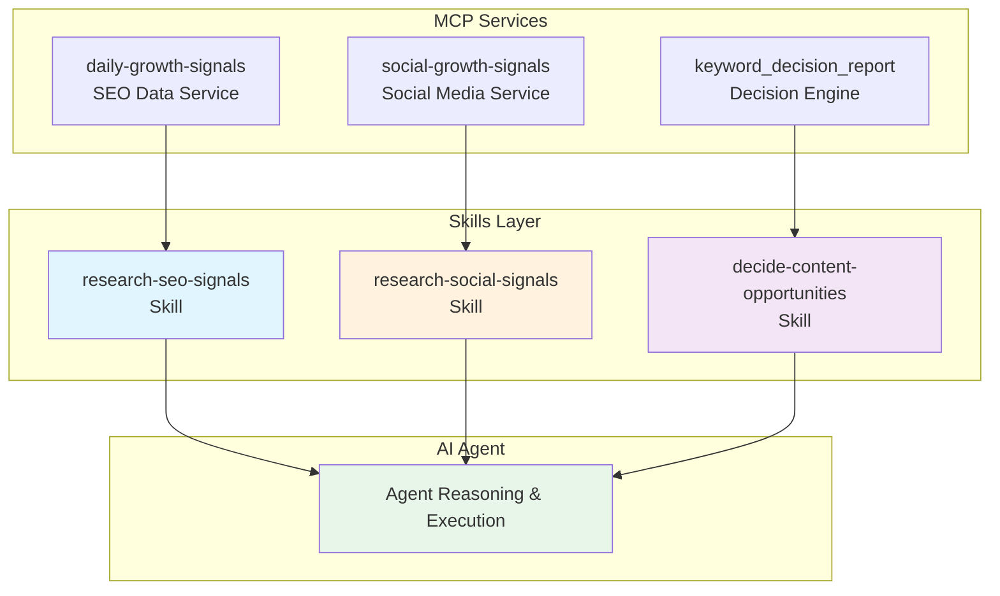

# SEO Signal Skills Documentation

[中文](README-zh.md)

### Overview

SEO Signal Skills is a structured skill set designed to enhance AI agent precision when interacting with SEO and social media data services through MCP (Model Context Protocol). These skills provide standardized workflows, clear usage guidelines, and pre-processed data interpretations to ensure accurate, efficient, and evidence-based decision-making.

### Skill Set Overview

SignalDig Skills is an MCP-based SEO and content-growth skill set covering a complete evidence chain from signal collection to decision:

- **Research SEO Signals** (`research-seo-signals`): retrieves evidence-backed SEO demand signals — keyword overview and intent, related keywords, SERP observations, and Google Trends — across markets and languages, with minimal-scope submits and idempotent request reuse.
- **Retrieve Social Signals** (`research-social-signals`): retrieves traceable, public, platform-native social data from X, Reddit, Xiaohongshu, Zhihu, LinkedIn, and WeChat Official Accounts, preserving raw fields, timestamps, and native metrics — retrieval only, no decisions.
- **Decide Content Opportunities** (`decide-content-opportunities`): turns the gathered evidence into conditional keyword and content-opportunity decisions with an explicit stance, qualitative confidence, counter-evidence, conditions, risks, and a next validation test.

All three skills share one principle: every claim must cite traceable evidence, never invent metrics, never turn data into an automatic decision, and never override the user's final call. Built for evidence-constrained growth workflows where AI agents execute with proof, not guesses.

### Why Use Skills?

While AI agents can directly invoke MCP tools, using structured skills offers significant advantages:

| Aspect | Without Skills | With Skills |
|--------|---------------|-------------|
| **Precision** | Agent may or may not call the right tools | Guaranteed correct tool selection |
| **Efficiency** | Agent explores tool combinations randomly | Optimized workflow with minimal calls |
| **Interpretation** | Raw data without context | Enhanced data with field semantics and explanations |
| **Decision Quality** | Agent reasoning may diverge | Focused analysis with actionable recommendations |

**Key Benefits:**

1. **Targeted Execution**: Each skill maps to a specific use case, eliminating guesswork in tool selection
2. **Enhanced Data Understanding**: Pre-processed signals with filtered outdated data and annotated field meanings
3. **Pre-Agent Reasoning**: Core insights and action recommendations are extracted before agent processing, preventing reasoning diffusion
4. **Operational Handbook**: Serves as a built-in user manual for AI agents, enabling more confident tool utilization

---

### Skill Categories

#### 1. Research SEO Signals (`research-seo-signals`)

**MCP Service**: `daily-growth-signals`

**Purpose**: Gather evidence-backed SEO demand signals from multiple authoritative sources.

**Data Sources**:
- Google Trends (interest over time, geographic distribution, related queries)
- Keyword Overview & Intent Analysis (search volume, CPC, competition metrics)
- Related Keywords Discovery (semantic expansions, long-tail opportunities)
- Google/Bing SERP Data (organic rankings, SERP features, competitive landscape)
- GEO visibility, competitor context, backlinks, and referring domains

**Value Proposition**:
Unlike raw data providers that return numbers without context, this service:
- **Filters obsolete data**: Removes outdated signals that no longer reflect current market conditions
- **Annotates field semantics**: Explains the meaning, unit, and caveats of each metric
- **Enhances AI comprehension**: Transforms raw data into interpretable evidence with context

**Tools Available**:
- `submit_keyword_research_signals` – Submit multi-scope SEO research request
- `submit_specific_seo_data` – Submit single-family data request
- `submit_competitor_analysis` – Submit competitor analysis for a keyword and domain
- `submit_geo_analysis` – Submit GEO/AI-search visibility analysis
- `submit_backlink_analysis` – Submit backlink and referring-domain analysis
- `get_keyword_research_signals` – Retrieve research results by request ID

Traditional SEO uses `submit_specific_seo_data` for one data family. Its `serp` scope defaults to Google; pass `search_engine: "bing"` only when Bing is explicitly requested. Competitor, GEO, and backlink requests use dedicated tools that hide provider endpoints and search-task details. Interpret terminal results through their returned `field_semantics`, `limitations`, `usage`, and evidence references.

**Use Cases**:
- Keyword validation and demand analysis
- Search intent discovery and classification
- SERP pattern review and competitive intelligence
- Market comparison and opportunity briefs

---

#### 2. Retrieve Social Signals (`research-social-signals`)

**MCP Service**: `social-growth-signals`

**Purpose**: Validate retrieval inputs and collect traceable underlying social data without making analysis decisions.

**Platforms Covered**:
- **X (Twitter)**: Real-time conversations, trending topics
- **Reddit**: Community discussions, user feedback, pain points
- **Xiaohongshu (Little Red Book)**: Chinese lifestyle content, consumer discussions
- **Zhihu**: Chinese long-form articles, answers, and author perspectives
- **LinkedIn**: Member posts, commented or reacted content, and available impression metrics
- **WeChat Official Accounts**: Raw account articles and parsed public engagement metrics

**Tools Available**:
- `search_x_posts` – Query-bounded X/Twitter post retrieval
- `search_reddit_posts` – Reddit community post discovery
- `search_xiaohongshu_notes` – Xiaohongshu note search with image support
- `get_xiaohongshu_user_notes` – Xiaohongshu creator note history with cursor paging
- `get_linkedin_user_posts` – LinkedIn member activity and available engagement evidence
- `get_wechat_account_articles` – Raw WeChat Official Account articles with parsed metrics
- `search_zhihu_articles` – Zhihu content search with exact parameter preservation
- `get_x_trends` – Current X trending topics by country/region

**Use Cases**:
- Validate account identifiers, profile URLs, filters, and continuation values
- Retrieve public posts, creator histories, account content, trends, and native metrics
- Supply traceable source data for downstream AI analysis
- Preserve raw fields and collection boundaries without recommendations

---

#### 3. Decide Content Opportunities (`decide-content-opportunities`)

**MCP Service**: `keyword_decision_report`

**Purpose**: Generate actionable keyword and content prioritization recommendations based on synthesized SEO evidence.

**Target Audience**:
This skill specifically addresses the needs of:
- **Marketing beginners** who lack experience in interpreting SEO metrics
- **SEO newcomers** who understand data exists but don't know how to apply it
- **Operations teams** who need clear direction without deep analytical expertise

**How It Works**:

```
┌─────────────────────────────────────────────────────────────┐
│                    Decision Pipeline                        │
├─────────────────────────────────────────────────────────────┤
│                                                             │
│  1. Data Collection Layer                                   │
│     (Research SEO Signals + Social Signals)                 │
│                    ↓                                        │
│  2. Pre-Agent Reasoning Layer ◄── KEY DIFFERENTIATOR       │
│     • Extract core insights                                 │
│     • Generate action recommendations                       │
│     • Prevent AI reasoning diffusion                        │
│                    ↓                                        │
│  3. Agent Processing Layer                                  │
│     • Focused analysis on curated inputs                   │
│     • Contextual recommendation delivery                   │
│                                                             │
└─────────────────────────────────────────────────────────────┘
```

**Why Pre-Agent Reasoning Matters**:

Although AI agents have built-in LLM reasoning capabilities (depending on the model used), this service performs **pre-processing before agent invocation** to:
- Extract core content and action suggestions upfront
- Prevent autonomous reasoning divergence
- Ensure consistent, focused output regardless of model variations

**Tools Available**:
- `submit_keyword_decision_report` – Submit decision analysis request
- `get_keyword_decision_report` – Retrieve decision report by request ID

**Output Includes**:
- Clear stance (pursue / defer / validate)
- Qualitative confidence level (high / medium / low)
- Supporting evidence with traceable IDs
- Counter-evidence and risk factors
- Actionable next steps with validation tests
- Conditions that would change the recommendation

---

### Architecture Diagram



---

### Quick Reference

| Skill Name | MCP Service | Primary Function | Best For |
|------------|-------------|------------------|----------|
| `research-seo-signals` | daily-growth-signals | SEO data collection | Keyword research, demand analysis |
| `research-social-signals` | social-growth-signals | Social media listening | Brand monitoring, user feedback |
| `decide-content-opportunities` | keyword_decision_report | Decision recommendations | Content prioritization, strategy |

---

### Get Your API Key

Sign up and log in at <https://signaldig.com/>, then create and retrieve your API key from your account settings to replace `{your_api_key}` in the configuration example above.

---
