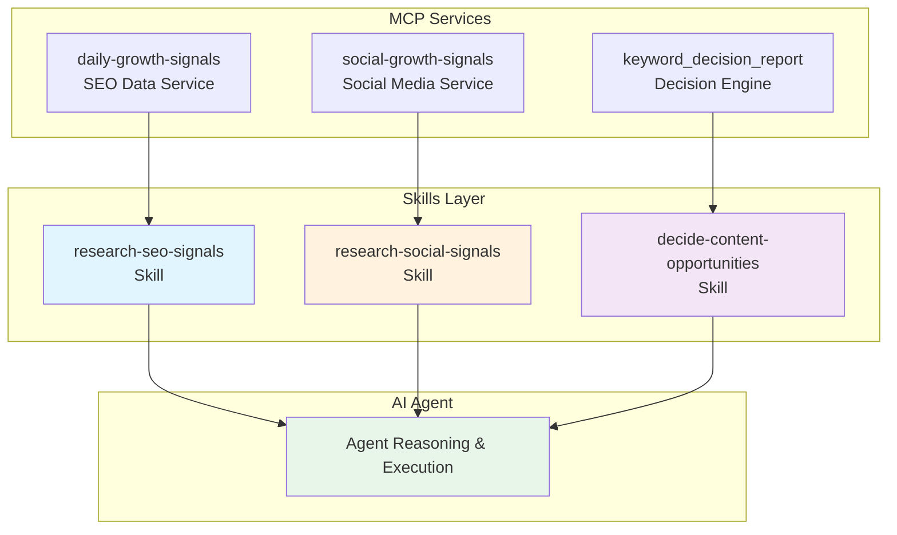
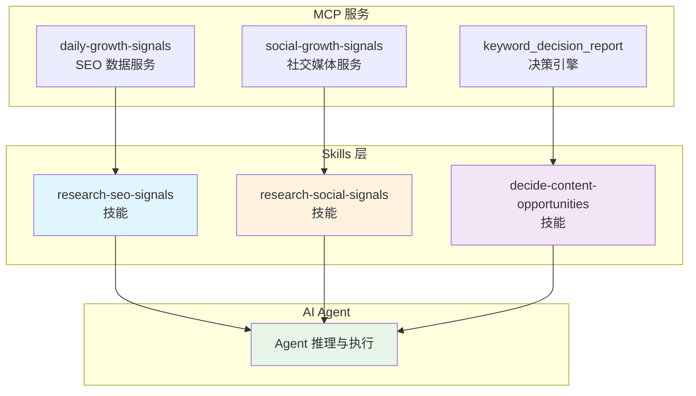

# SEO Signal Skills 说明文档 / Documentation

[English](#english) | [中文](#中文)

---

<a id="english"></a>
## English

### Overview

SEO Signal Skills is a structured skill set designed to enhance AI agent precision when interacting with SEO and social media data services through MCP (Model Context Protocol). These skills provide standardized workflows, clear usage guidelines, and pre-processed data interpretations to ensure accurate, efficient, and evidence-based decision-making.

### Why Use Skills?

While AI agents can directly invoke MCP tools, using structured skills offers significant advantages:

| Aspect | Without Skills | With Skills |
|--------|---------------|-------------|
| **Precision** | Agent may or may not call the right tools | Guaranteed correct tool selection |
| **Efficiency** | Agent explores tool combinations randomly | Optimized workflow with minimal calls |
| **Interpretation** | Raw data without context | Enhanced data with field semantics and explanations |
| **Decision Quality** | Agent reasoning may diverge | Focused analysis with actionable recommendations |

**Key Benefits:**

1. **Targeted Execution**: Each skill maps to a specific use case, eliminating guesswork in tool selection
2. **Enhanced Data Understanding**: Pre-processed signals with filtered outdated data and annotated field meanings
3. **Pre-Agent Reasoning**: Core insights and action recommendations are extracted before agent processing, preventing reasoning diffusion
4. **Operational Handbook**: Serves as a built-in user manual for AI agents, enabling more confident tool utilization

---

### Skill Categories

#### 1. Research SEO Signals (`research-seo-signals`)

**MCP Service**: `daily-growth-signals`

**Purpose**: Gather evidence-backed SEO demand signals from multiple authoritative sources.

**Data Sources**:
- Google Trends (interest over time, geographic distribution, related queries)
- Keyword Overview & Intent Analysis (search volume, CPC, competition metrics)
- Related Keywords Discovery (semantic expansions, long-tail opportunities)
- Google SERP Data (organic rankings, SERP features, competitive landscape)

**Value Proposition**:
Unlike raw data providers that return numbers without context, this service:
- **Filters obsolete data**: Removes outdated signals that no longer reflect current market conditions
- **Annotates field semantics**: Explains the meaning, unit, and caveats of each metric
- **Enhances AI comprehension**: Transforms raw data into interpretable evidence with context

**Tools Available**:
- `submit_keyword_research_signals` – Submit multi-scope SEO research request
- `submit_specific_seo_data` – Submit single-family data request
- `get_keyword_research_signals` – Retrieve research results by request ID

**Use Cases**:
- Keyword validation and demand analysis
- Search intent discovery and classification
- SERP pattern review and competitive intelligence
- Market comparison and opportunity briefs

---

#### 2. Research Social Signals (`research-social-signals`)

**MCP Service**: `social-growth-signals`

**Purpose**: Collect traceable social media conversations and trend data from major platforms.

**Platforms Covered**:
- **X (Twitter)**: Real-time conversations, trending topics
- **Reddit**: Community discussions, user feedback, pain points
- **Xiaohongshu (Little Red Book)**: Chinese lifestyle content, consumer discussions
- **Zhihu**: Chinese long-form articles, answers, and author perspectives

**Tools Available**:
- `search_x_posts` – Query-bounded X/Twitter post retrieval
- `search_reddit_posts` – Reddit community post discovery
- `search_xiaohongshu_notes` – Xiaohongshu note search with image support
- `search_zhihu_articles` – Zhihu content search with exact parameter preservation
- `get_x_trends` – Current X trending topics by country/region

**Use Cases**:
- Social listening and brand monitoring
- User language discovery and pain point identification
- Product/competitor mention tracking
- Campaign research and audience feedback analysis

---

#### 3. Decide Content Opportunities (`decide-content-opportunities`)

**MCP Service**: `keyword_decision_report`

**Purpose**: Generate actionable keyword and content prioritization recommendations based on synthesized SEO evidence.

**Target Audience**:
This skill specifically addresses the needs of:
- **Marketing beginners** who lack experience in interpreting SEO metrics
- **SEO newcomers** who understand data exists but don't know how to apply it
- **Operations teams** who need clear direction without deep analytical expertise

**How It Works**:

```
┌─────────────────────────────────────────────────────────────┐
│                    Decision Pipeline                        │
├─────────────────────────────────────────────────────────────┤
│                                                             │
│  1. Data Collection Layer                                   │
│     (Research SEO Signals + Social Signals)                 │
│                    ↓                                        │
│  2. Pre-Agent Reasoning Layer ◄── KEY DIFFERENTIATOR       │
│     • Extract core insights                                 │
│     • Generate action recommendations                       │
│     • Prevent AI reasoning diffusion                        │
│                    ↓                                        │
│  3. Agent Processing Layer                                  │
│     • Focused analysis on curated inputs                   │
│     • Contextual recommendation delivery                   │
│                                                             │
└─────────────────────────────────────────────────────────────┘
```

**Why Pre-Agent Reasoning Matters**:

Although AI agents have built-in LLM reasoning capabilities (depending on the model used), this service performs **pre-processing before agent invocation** to:
- Extract core content and action suggestions upfront
- Prevent autonomous reasoning divergence
- Ensure consistent, focused output regardless of model variations

**Tools Available**:
- `submit_keyword_decision_report` – Submit decision analysis request
- `get_keyword_decision_report` – Retrieve decision report by request ID

**Output Includes**:
- Clear stance (pursue / defer / validate)
- Qualitative confidence level (high / medium / low)
- Supporting evidence with traceable IDs
- Counter-evidence and risk factors
- Actionable next steps with validation tests
- Conditions that would change the recommendation

---

### Architecture Diagram



---

### Quick Reference

| Skill Name | MCP Service | Primary Function | Best For |
|------------|-------------|------------------|----------|
| `research-seo-signals` | daily-growth-signals | SEO data collection | Keyword research, demand analysis |
| `research-social-signals` | social-growth-signals | Social media listening | Brand monitoring, user feedback |
| `decide-content-opportunities` | keyword_decision_report | Decision recommendations | Content prioritization, strategy |

---

<a id="中文"></a>
## 中文

### 概述

SEO Signal Skills 是一套结构化的技能集，旨在通过 MCP（模型上下文协议）增强 AI Agent 与 SEO 及社交媒体数据服务交互时的精确性。这些技能提供标准化工作流程、清晰的使用指南以及预处理的数据解读，确保决策的准确性、高效性和证据支撑性。

### 为什么使用 Skills？

虽然 AI Agent 可以直接调用 MCP 工具，但使用结构化技能具有显著优势：

| 维度 | 不使用 Skills | 使用 Skills |
|------|--------------|-------------|
| **精确性** | Agent 可能调用错误的工具 | 保证选择正确的工具 |
| **效率** | Agent 随机探索工具组合 | 优化工作流程，最小化调用次数 |
| **数据理解** | 原始数据缺乏上下文 | 增强数据附带字段语义和详细解释 |
| **决策质量** | Agent 推理可能发散 | 聚焦分析，提供可操作建议 |

**核心优势**：

1. **精准执行**：每个技能对应特定场景，消除工具选择的盲目性
2. **增强数据理解**：预处理的信号已过滤过时数据，并标注字段含义
3. **前置推理机制**：在 Agent 处理前提取核心洞察和建议，防止推理发散
4. **内置操作手册**：作为 AI Agent 的使用指南，提升工具调用的自信心

---

### 技能分类

#### 1. 研究 SEO 信号 (`research-seo-signals`)

**MCP 服务**：`daily-growth-signals`

**用途**：从多个权威来源收集有据可依的 SEO 需求信号。

**数据来源**：
- Google Trends（搜索趋势随时间变化、地理分布、相关查询）
- 关键词概览与意图分析（搜索量、CPC、竞争指标）
- 相关关键词发现（语义扩展、长尾机会）
- Google SERP 数据（自然排名、SERP 特征、竞争格局）

**价值主张**：
与仅返回数字而无上下文的原始数据提供商不同，本服务：
- **过滤陈旧数据**：移除不再反映当前市场状况的过时信号
- **注释字段语义**：解释每个指标的含义、单位和注意事项
- **增强 AI 理解能力**：将原始数据转化为带上下文的可解释证据

**可用工具**：
- `submit_keyword_research_signals` – 提交多范围 SEO 研究请求
- `submit_specific_seo_data` – 提交单类数据请求
- `get_keyword_research_signals` – 按请求 ID 获取研究结果

**适用场景**：
- 关键词验证和需求分析
- 搜索意图发现与分类
- SERP 模式审查和竞争情报
- 市场对比和机会简报

---

#### 2. 研究社交信号 (`research-social-signals`)

**MCP 服务**：`social-growth-signals`

**用途**：从主流平台收集可追溯的社交媒体对话和趋势数据。

**覆盖平台**：
- **X (Twitter)**：实时对话、热门话题
- **Reddit**：社区讨论、用户反馈、痛点挖掘
- **知乎**：中文长文、回答与作者观点研究
- **小红书**：中文生活方式内容、消费者讨论

**可用工具**：
- `search_x_posts` – 有界查询的 X/Twitter 帖子检索
- `search_reddit_posts` – Reddit 社区帖子发现
- `search_xiaohongshu_notes` – 小红书笔记搜索（支持图片）
- `search_zhihu_articles` – 知乎内容搜索（原样保留搜索参数）
- `get_x_trends` – 按国家/地区获取当前 X 热门话题

**适用场景**：
- 社交聆听和品牌监控
- 用户语言发现和痛点识别
- 产品/竞争对手提及追踪
- 活动研究和受众反馈分析

---

#### 3. 决策内容机会 (`decide-content-opportunities`)

**MCP 服务**：`keyword_decision_report`

**用途**：基于综合 SEO 证据生成可操作的关键词和内容优先级建议。

**目标受众**：
本技能专门服务于：
- **运营新手**：缺乏解读 SEO 指标经验的从业者
- **SEO 新人**：了解数据存在但不知如何应用的初学者
- **运营团队**：需要明确方向而无需深度分析专业知识的团队

**工作原理**：

```
┌─────────────────────────────────────────────────────────────┐
│                      决策流水线                              │
├─────────────────────────────────────────────────────────────┤
│                                                             │
│  1. 数据采集层                                               │
│     (研究 SEO 信号 + 社交信号)                               │
│                    ↓                                        │
│  2. Agent 前置推理层 ◄── 核心差异化                          │
│     • 提取核心洞察                                           │
│     • 生成行动建议                                           │
│     • 防止 AI 推理发散                                       │
│                    ↓                                        │
│  3. Agent 处理层                                             │
│     • 基于精选输入的聚焦分析                                 │
│     • 交付上下文化建议                                       │
│                                                             │
└─────────────────────────────────────────────────────────────┘
```

**为什么前置推理很重要**：

尽管 AI Agent 具备内置 LLM 推理能力（取决于所使用的模型），本服务在 **Agent 调用之前进行预处理** 以：
- 提前提取核心内容和行动建议
- 防止自主推理发散
- 确保无论模型差异如何，输出都保持一致且聚焦

**可用工具**：
- `submit_keyword_decision_report` – 提交决策分析请求
- `get_keyword_decision_report` – 按请求 ID 获取决策报告

**输出包含**：
- 明确立场（追求 / 延后 / 验证）
- 定性置信度等级（高 / 中 / 低）
- 带可追溯 ID 的支撑证据
- 反证和风险因素
- 可操作的下一步骤及验证测试
- 可能改变建议的条件

---

### 架构图



---

### 快速参考表

| 技能名称 | MCP 服务 | 主要功能 | 适用场景 |
|----------|----------|----------|----------|
| `research-seo-signals` | daily-growth-signals | SEO 数据采集 | 关键词研究、需求分析 |
| `research-social-signals` | social-growth-signals | 社交媒体监听 | 品牌监控、用户反馈 |
| `decide-content-opportunities` | keyword_decision_report | 决策建议 | 内容优先级排序、策略制定 |

---

### MCP 配置示例

```json
{
  "mcpServers": {
    "daily-growth-signals": {
      "type": "http",
      "url": "https://mcp.signaldig.com/data/seo/mcp",
      "headers": {
        "Authorization": "Bearer {your_api_key}"
      },
      "disabled": false
    },
    "social-growth-signals": {
      "type": "http",
      "url": "https://mcp.signaldig.com/data/social/mcp",
      "headers": {
        "Authorization": "Bearer {your_api_key}"
      },
      "disabled": false
    },
    "keyword_decision_report": {
      "type": "http",
      "url": "https://mcp.signaldig.com/signals/seo/mcp",
      "headers": {
        "Authorization": "Bearer {your_api_key}"
      },
      "disabled": false
    }
  }
}
```

---

*文档版本: 1.0.0*
*最后更新: 2026-08-10*
